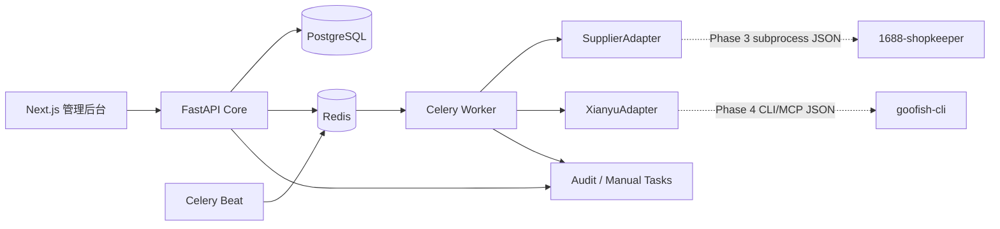
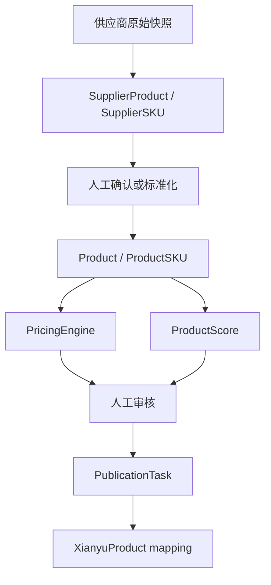

# AutoFish 架构

## 1. 系统边界

AutoFish Core 拥有商品、供应商映射、成本、定价、利润、订单状态、AI 决策、风险、任务和审计。外部 Adapter 只负责“获取平台数据”或“执行已批准的平台动作”，不得直接修改核心数据库。

Phase 0–2 不连接真实闲鱼和 1688；只启用 Mock/Manual Adapter。



## 2. 运行单元

| 服务 | 职责 | 对外端口 |
|---|---|---|
| frontend | 登录、总览、商品、任务、风险和设置 | 18180 |
| backend | API、认证、事务、规则引擎、健康检查 | 18181 |
| worker | AutomationJob 执行、有限重试、Adapter 调用 | 无 |
| scheduler | 按策略生成幂等任务；默认关闭 | 无 |
| postgres | 权威业务数据 | 无 |
| redis | Celery broker/result、短期锁和限流 | 无 |

后台与 worker 共用后端领域包，但 worker 只能通过服务层改变状态。PostgreSQL/Redis 不映射宿主机端口。

## 3. 分层

```text
API / Worker entrypoints
        ↓
Application services (use cases, transactions, authorization)
        ↓
Domain services (pricing, score, state machine, risk rules)
        ↓
Repositories / SQLAlchemy models
        ↓
PostgreSQL

Application services → Adapter ports → external subprocess/MCP
```

- API 层不实现定价和评分。
- Domain 层不 import FastAPI、Celery 或平台库。
- Adapter 不知道内部订单利润规则。
- Agent 只能返回建议；关键结果由 Domain 层验证。

## 4. 商品数据流



供应商商品与内部售卖商品分表：一个内部 Product 可以从多个 SupplierProduct 选择备用来源；历史快照永不覆盖原始来源。

## 5. 任务与失败恢复

AutomationJob 必须拥有：

- `idempotency_key` 唯一键；
- 状态 `PENDING/RUNNING/SUCCEEDED/RETRY/FAILED/MANUAL_REQUIRED/CANCELLED`；
- `attempts`、`max_attempts`（默认 3）、`timeout_seconds`；
- `scheduled_at/started_at/finished_at/heartbeat_at`；
- 脱敏输入、输出摘要、错误码和 correlation ID。

失败退避为 1 分钟、5 分钟，第三次失败后创建 ManualTask。验证码、风控、人脸、二次确认、未知平台响应不参与重试，直接人工接管。

## 6. Kill Switch

`automation_controls` 以功能维度持久化：

- `GLOBAL`
- `PUBLISH`
- `CUSTOMER_SERVICE`
- `PURCHASE`
- `REPRICING`
- `LOGISTICS`

worker 在领取任务和执行不可逆动作前各检查一次。每项控制还包含 `REVIEW/AUTOMATIC`、每日限额、最小间隔、失败阈值和熔断时间。`GLOBAL=false` 优先级最高；关闭开关不影响后台、数据库、日志、只读查询与人工任务。

## 7. 可观测性

- `/health`：进程存活；`/ready`：数据库与 Redis 就绪。
- 所有请求生成 correlation ID。
- AuditLog 保存 actor、action、entity、before/after 摘要、result、IP 和 correlation ID。
- AdapterCall 保存 adapter/version/command/exit_code/duration/error/raw_snapshot_hash。
- 日志只输出脱敏摘要，不输出 Cookie、Token、买家完整隐私或请求签名。

## 8. 部署

NAS 目录使用 `/Volume2/docker/autofish`；应用端口 `18180/18181`。镜像在 NAS 本地构建，数据 bind mount 到项目的 `data/`。正式更新先备份数据库，再执行 migration、健康检查和前端烟雾测试。
