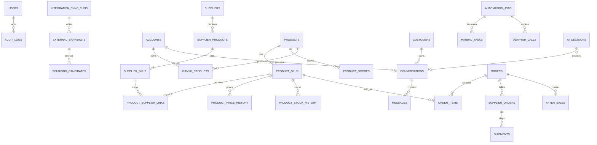

# 数据库设计

## 1. 领域分组

| 分组 | 表 |
|---|---|
| 身份与账号 | `users`, `accounts` |
| 外部集成事实 | `integration_sync_runs`, `external_snapshots`, `sourcing_candidates` |
| 供应链 | `suppliers`, `supplier_products`, `supplier_skus` |
| 内部商品 | `products`, `product_skus`, `product_supplier_links`, `product_price_history`, `product_stock_history`, `product_scores`, `pricing_rules` |
| 闲鱼映射 | `xianyu_products` |
| 客服 | `customers`, `conversations`, `messages` |
| 订单履约 | `orders`, `order_items`, `supplier_orders`, `shipments`, `after_sales` |
| AI/自动化 | `ai_decisions`, `automation_jobs`, `automation_controls`, `manual_tasks`, `adapter_calls` |
| 审计 | `audit_logs` |

## 2. ER 总览



## 3. 关键表

### suppliers / supplier_products / supplier_skus

- `supplier_products.external_product_id` 与 `supplier_id` 联合唯一。
- `raw_snapshot` 保存外部原始结构，`snapshot_hash` 用于追溯和去重。
- `supplier_skus` 保存外部 SKU、规格、当前采购价和库存。
- 凭证不进入这些表，只保存凭证引用 `credential_ref`。

### integration_sync_runs / external_snapshots / sourcing_candidates

- 每次外部搜索或同步先创建 `integration_sync_runs`，保存来源、版本、correlation ID、读取/写入计数与安全错误。
- `external_snapshots` 以 `platform + object_type + external_id + payload_hash` 唯一，重复事实不追加；原始载荷落库前递归遮蔽 Cookie、Token、密码、手机号与地址字段。
- `sourcing_candidates` 保存可检索的标准字段和来源快照引用；只有类目、供应商、结构化 SKU 完整且未命中排除类目时才允许导入。
- 外部价格/库存是带 `fetched_at` 的事实快照，不代表当前可履约承诺。

### products / product_skus

- Product 是面向闲鱼的标准化商品；SupplierProduct 是来源商品，二者不可合并。
- 生命周期：`CANDIDATE/TESTING/ACTIVE/WINNER/DECLINING/PAUSED/REMOVED`。
- `product_supplier_links` 允许一个内部 SKU 对应多个供应商 SKU，并保存优先级与启用状态。

### pricing_rules / product_scores

- 金额字段使用 `NUMERIC(14,2)`，百分比使用 `NUMERIC(7,4)`。
- PricingRule 记录平台费、风险准备金、最低利润和议价空间的有效期。
- ProductScore 每次计算追加一行，保存八个分项、权重、总分、版本和输入哈希。

```text
FinalCost = SupplierCost + SupplierShipping + PlatformFee + AfterSalesReserve
MinimumSalePrice = FinalCost + MinimumProfit
TargetSalePrice = FinalCost + TargetProfit
RecommendedPrice = TargetSalePrice + NegotiationMargin

必须满足 `TargetProfit >= MinimumProfit`。所有价格均由 Decimal 引擎计算并按分四舍五入；
任何议价结果都必须再次通过 `CandidatePrice >= MinimumSalePrice` 的代码校验。
ExpectedProfit = Revenue - FinalCost
ActualProfit = Revenue - ActualSupplierCost - ActualShipping - ActualPlatformFee - ActualAfterSalesCost
```

### orders

正常状态机：

```text
NEW → PAID → SUPPLIER_CHECK → PURCHASE_PENDING → PURCHASED
→ SUPPLIER_SHIPPED → XIANYU_SHIPPED → DELIVERED → COMPLETED
```

异常状态：`OUT_OF_STOCK/PRICE_CHANGED/PURCHASE_FAILED/ADDRESS_ERROR/LOGISTICS_ERROR/AFTERSALES/REFUND_PENDING/DISPUTE/MANUAL_REQUIRED`。

状态迁移由代码白名单控制，并在 AuditLog 保存前后状态；禁止 SQL 任意跳转。

### automation_jobs

- `idempotency_key` 全局唯一；相同业务动作不会重复执行。
- `payload` 只存脱敏业务 ID，不存 Cookie/Token。
- `max_attempts <= 3`；验证/风控类错误直接人工。
- worker 使用行锁或 Redis 短锁避免并发领取。

## 4. 索引与约束

- 所有外部 ID 与来源组成唯一索引。
- 对 `status, scheduled_at` 建 AutomationJob 领取索引。
- 对 `conversation_id, created_at`、`order_id, created_at`、`product_sku_id, checked_at` 建查询索引。
- 外键默认 `RESTRICT`；历史和审计表不级联删除。
- 业务数据使用 `created_at/updated_at` UTC timestamptz，前端按 Asia/Shanghai 展示。

## 5. 隐私与保留

- 买家姓名、电话、地址在 Phase 7 使用应用层加密列；列表默认脱敏。
- 消息正文按运营需要配置保留期，删除后保留不可逆哈希与审计元数据。
- AuditLog、资金和订单历史不可物理删除，只允许归档。
